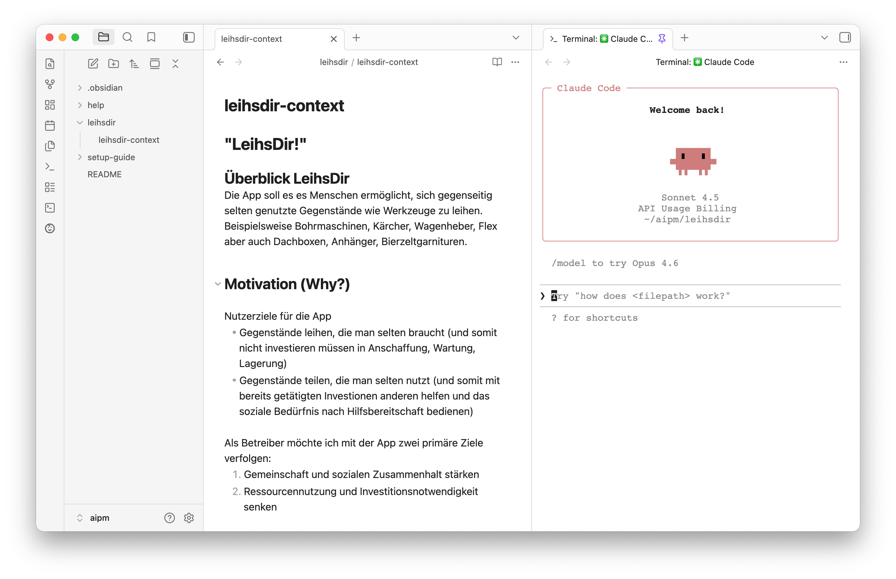

# AIPM Setup Guide Repository

Willkommen! Dieses Repository hilft dir, eine erste Arbeitsumgebung für das AIPM-Training aufzusetzen. Du lernst, mit **Claude Code** (KI-Assistent im Terminal) und **Obsidian** (komfortabler Markdown-Editor mit Dateibrowser) zu arbeiten -- Werkzeuge, die dir als Product Manager helfen, effizienter mit KI zusammenzuarbeiten.

## So sieht deine Arbeitsumgebung nach dem Setup aus

*Obsidian mit drei Bereichen. Links: Dateibrowser, Mitte: Markdown-Editor, Rechts: Claude Code im Terminal.*

---

## Erste Schritte

**Starte hier:** [Setup Guide](setup-guide/README.md)

Die Anleitung führt dich Schritt für Schritt durch die Installation und Einrichtung. Plane ca. 30 Minuten ein.

---

## Nach dem Setup: Deine Arbeitsordner

Sobald du alles eingerichtet hast, arbeitest du in Unterordnern dieses Repositories:

- **`leihsdir/`** -- Erste Case Study für das Training (Beispielkontext zur Verleih-App "LeihsDir!")
- **`help/`** -- Hilfsdateien zu Obsidian, Markdown, Claude Code, etc.

Diese Ordner bilden deinen Workspace, in dem du mit Claude Code und Obsidian zusammenarbeitest.

---

## Hilfe & Dokumentation

Im `help/`-Ordner findest du Anleitungen für die wichtigsten Arbeitsschritte:

- **[Obsidian Basics](help/obsidian-basics.md)** -- Tastaturkürzel, Navigation, Command Palette
- **[Markdown Basics](help/markdown-basics.md)** -- Formatierung, Links, Listen
- **[Claude Code Basics](help/claudecode-basics.md)** -- Kommandos, Arbeitsweise, Best Practices
- **[Das @-Zeichen in Claude Code](help/atsign.md)** -- Dateien und Ordner als Kontext nutzen

---

## Fragen?

Bei Problemen beim Setup oder Fragen zur Arbeitsumgebung melde dich gerne vor dem Training.
