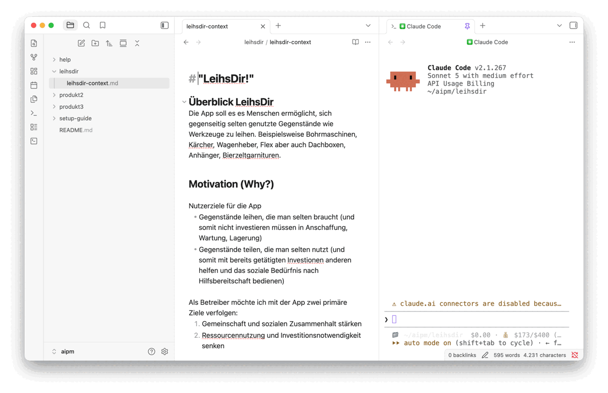

# AIPM Setup Guide Repository

Willkommen! Dieses Repository hilft dir, eine erste Arbeitsumgebung für das AIPM-Training aufzusetzen. Du lernst, mit einem KI-Assistenten im Terminal (**Claude Code oder Codex**) und **Obsidian** (komfortabler Markdown-Editor mit Dateibrowser) zu arbeiten -- Werkzeuge, die dir als Product Manager helfen, effizienter mit KI zusammenzuarbeiten.

## So sieht deine Arbeitsumgebung nach dem Setup aus

*Obsidian mit drei Bereichen. Links: Dateibrowser, Mitte: Markdown-Editor, Rechts: der KI-Assistent im Terminal. Welcher Assistent dort läuft, hängt davon ab, was bei euch installiert ist -- das Bild wechselt zwischen Claude Code, Codex, OpenCode und Antigravity. Die Oberfläche bleibt dieselbe.*

---

## Erste Schritte: Welches Werkzeug nutzt ihr?

Es gibt zwei Anleitungen -- eine je Werkzeug. Nimm die, die zu deinem Unternehmen passt. Wenn du nicht weißt, welche das ist, frag deinen Admin oder melde dich bei mir.

| | |
|---|---|
| **[Setup Guide für Claude Code](setup-guide/claude/README.md)** | Claude Code ist der KI-Assistent von Anthropic. |
| **[Setup Guide für Codex](setup-guide/codex/README.md)** | Codex ist der KI-Assistent von OpenAI. |

Die Anleitung führt dich Schritt für Schritt durch Installation und Einrichtung. Plane ca. 30 Minuten ein. Am Ende räumst du die Dateien des jeweils anderen Werkzeugs weg -- danach steht in deinem Arbeitsordner nur noch das, was für dich gilt.

Beide Anleitungen führen zum selben Ergebnis: Obsidian als Oberfläche, der KI-Assistent im eingebetteten Terminal, dieselben Beispieldateien.

---

## Nach dem Setup: Deine Arbeitsordner

Sobald du alles eingerichtet hast, arbeitest du in Unterordnern dieses Repositories:

- **`leihsdir/`** -- Erste Case Study für das Training (Beispielkontext zur Verleih-App "LeihsDir")
- **`produkt2/`** und **`produkt3/`** -- Platzhalter für deine eigenen Themen: ein zweites Produkt, eine Initiative, ein Projekt, ein Kunde
- **`help/`** -- Hilfsdateien zu Obsidian, Markdown und deinem KI-Assistenten

Diese Ordner bilden deinen Workspace, in dem du mit dem KI-Assistenten und Obsidian zusammenarbeitest.

Die Produktordner liegen bewusst getrennt: Jedes Thema hat eigene Nutzer, Ziele und Begriffe. Wirfst du sie zusammen, vermischt der Assistent sie auch -- im Training schauen wir uns an, wie man Kontext gezielt gibt und sauber trennt.

---

## Hilfe & Dokumentation

Für alle:

- **[Obsidian Basics](help/obsidian-basics.md)** -- Tastaturkürzel, Navigation, Command Palette
- **[Markdown Basics](help/markdown-basics.md)** -- Formatierung, Links, Listen
- **[Kommandozeilen-Basics](help/commandline-basics.md)** -- die wichtigsten Befehle im Terminal
- **[Windows Terminal](help/windows-terminal.md)** -- PowerShell für Einsteiger

Je nach Werkzeug:

- **[Claude Code Basics](help/claude/claudecode-basics.md)** und **[Konfiguration](help/claude/claudecode-config.md)**
- **[Codex Basics](help/codex/codex-basics.md)** und **[Konfiguration](help/codex/codex-config.md)**

Bei Problemen: **[Troubleshooting](setup-guide/troubleshooting.md)** für git, Node.js und das Terminal-Plugin, dazu je eine Datei für [Claude Code](setup-guide/claude/troubleshooting.md) und [Codex](setup-guide/codex/troubleshooting.md).

---

## Fragen?

Bei Problemen beim Setup oder Fragen zur Arbeitsumgebung melde dich gerne vor dem Training.
