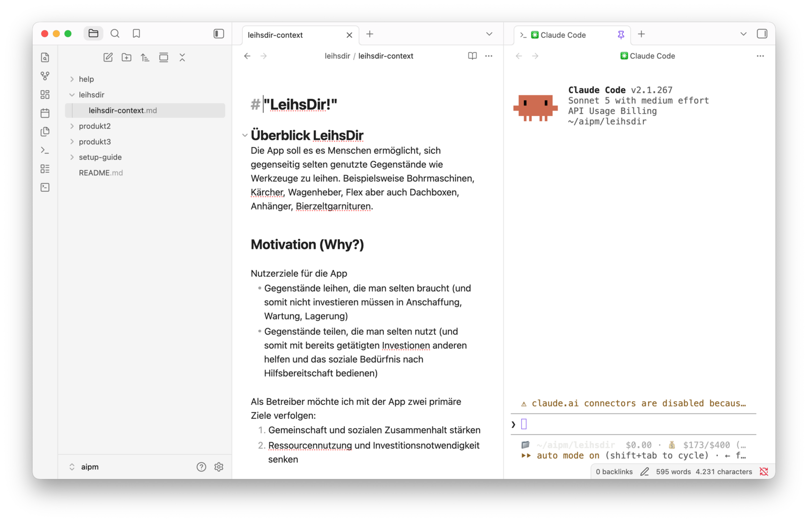
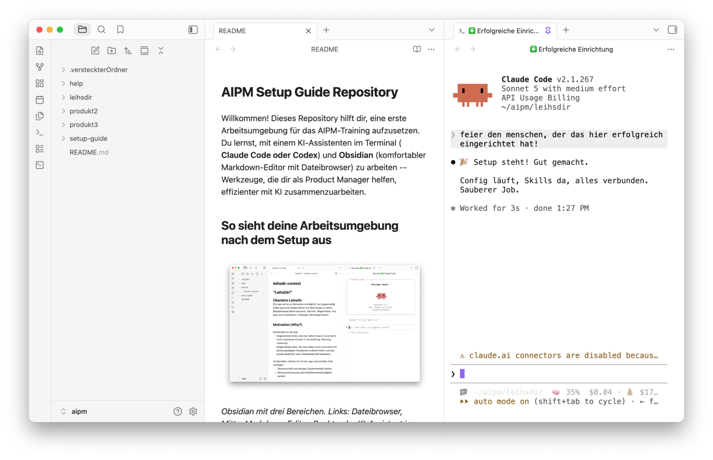

# AIPM Setup Guide -- Claude Code

Willkommen! Diese Anleitung hilft dir, deine Arbeitsumgebung für das Training einzurichten. Du brauchst **Claude Code** (ein KI-Assistent im Terminal) und **Obsidian** (ein komfortabler Editor für Textdateien im Markdown-Format).

Plane ca. 30 Minuten ein.

> **Nutzt ihr Codex statt Claude Code?** Dann nimm den [Setup Guide für Codex](../codex/README.md). Welches Werkzeug bei euch gilt, sagt dir dein Admin.

Am Ende hast du Obsidian mit drei Bereichen vor dir: links der Dateibrowser mit deinen Dateien, in der Mitte der Editor, rechts ein Terminal, in dem Claude Code läuft.



---

## Schritt 1: Ordner anlegen & Demo-Dateien holen

### Ordner anlegen

> **Neu bei der Kommandozeile?** Die Kommandozeile (auch Terminal genannt) ist ein Textfenster, in das du Befehle eintippst. Auf dem **Mac** findest du sie unter Programme → Dienstprogramme → Terminal (oder über Spotlight: `Cmd+Leertaste`, dann "Terminal" tippen). Unter **Windows** öffnest du PowerShell über das Startmenü (nach "PowerShell" suchen). Tippe den jeweiligen Befehl ein und drücke `Enter`, um ihn auszuführen.

Erstelle einen Ordner `aipm` in deinem Home-Verzeichnis:

**Mac (Terminal):**
```
mkdir ~/aipm
```

**Windows (PowerShell):**
```
mkdir $HOME\aipm
```

### Demo-Dateien herunterladen

Klone das Repository in deinen neuen Ordner:

**Mac (Terminal):**
```
git clone https://github.com/soehme/aipm-setupguide ~/aipm
```

**Windows (PowerShell):**
```
git clone https://github.com/soehme/aipm-setupguide $HOME\aipm
```

Danach findest du in `~/aipm` mehrere Beispieldateien und Ordner, die wir im Training nutzen.

> **"git" nicht erkannt?** Git ist dann nicht installiert. Entweder Git nachinstallieren ([git-scm.com/download/win](https://git-scm.com/download/win), PowerShell danach neu starten) oder das Repository als ZIP manuell von `https://github.com/soehme/aipm-setupguide` herunterladen (grüner "Code"-Button → "Download ZIP"). Details: [troubleshooting.md](../troubleshooting.md)

---

## Schritt 2: Claude Code installieren

> **Erst zum Admin.** Viele Unternehmen schränken ein, was auf dem Arbeitsrechner installiert werden darf, und geben einen eigenen Weg vor -- ein internes Software-Portal, eine vorbereitete Version oder einen Proxy. Frag vor der Installation nach, wie Claude Code bei euch installiert und angemeldet wird. Die Wege unten sind der Standardfall.

### Was ist Claude Code?

Claude Code ist Anthropics KI-Assistent für die Kommandozeile. Du stellst Fragen oder gibst Aufgaben in natürlicher Sprache ein, und Claude arbeitet direkt mit deinen Dateien -- liest, schreibt, analysiert und erklärt.

### Installation

**Mac (empfohlen -- nativer Installer):**
```
curl -fsSL https://claude.ai/install.sh | bash
```

**Mac (alternativ -- Homebrew):**
```
brew install --cask claude-code
```

**Windows:**
```
npm install -g @anthropic-ai/claude-code
```
Voraussetzung: Node.js 18 oder neuer (`node --version` zum Prüfen).

> **"npm" oder "node" nicht erkannt?** Node.js ist nicht installiert. Download: [nodejs.org/de/download](https://nodejs.org/de/download) -- beim Installer darauf achten, dass **"Add to PATH"** angehakt ist. Danach PowerShell neu starten. Details: [troubleshooting.md](../troubleshooting.md)

### API-Zugang einrichten

Claude Code braucht einen Zugang zu Anthropic. Beim ersten Start führt Claude Code dich durch ein Setup und fragt nach deinem Zugang. Dafür gibt es zwei Wege:

1. **Claude Subscription** (empfohlen für Einzelpersonen) -- Melde dich bei claude.ai an und wähle ein Abo.
2. **API Key** (empfohlen für Unternehmen) -- Dein Unternehmen stellt dir einen API Key bereit.

> Frag bei deinem Unternehmen nach, welchen Zugang du nutzen sollst, und richte ihn **vor dem Training** ein.

### Test: Funktioniert alles?

Wechsle in den Ordner `leihsdir` und starte Claude Code dort:

**Mac (Terminal):**
```
cd ~/aipm/leihsdir
claude
```

**Windows (PowerShell):**
```
cd $HOME\aipm\leihsdir
claude
```

> **"Do you trust the files in this folder?"** Diese Frage kommt beim ersten Start in einem neuen Ordner. Antworte mit **Ja** -- es ist dein eigener Ordner mit den Trainingsdateien.

Tippe dann:
```
Was ist 2 + 2?
```

Wenn du eine Antwort bekommst, ist alles eingerichtet. Beende mit `/exit`.

> **Warum in `leihsdir` starten?** In diesem Ordner liegt eine Einstellung, die Claude Code anweist, dich vor jeder Aktion (Datei ändern, Befehl ausführen) um Erlaubnis zu fragen. So siehst du im Training genau, was Claude gerade tut, bevor es passiert. Mehr dazu in [Claude Code Basics](../../help/claude/claudecode-basics.md#permission-mode-erlaubnis-fragen).

---

## Schritt 3: Obsidian installieren

> **Auch hier gilt:** Wenn du Software nicht selbst installieren darfst, frag deinen Admin nach Obsidian. Manche Unternehmen verteilen es über ein eigenes Portal.

### Was ist Obsidian?

Obsidian ist ein Editor für Markdown-Textdateien mit integriertem Dateibrowser. Für uns ist es die komfortable Oberfläche, in der wir Dateien verwalten, bearbeiten und mit KI arbeiten -- ohne Entwicklertools.

### Installation

1. Lade Obsidian herunter: [obsidian.md/download](https://obsidian.md/download)
2. Installiere die App (Mac: in den Applications-Ordner ziehen)

**Alternativ mit Homebrew (Mac):**
```
brew install --cask obsidian
```

### Vault öffnen

1. Starte Obsidian
2. Wähle **"Open folder as vault"** (Ordner als Vault öffnen)
3. Navigiere zu `~/aipm` und wähle den Ordner aus
4. Klicke **"Open"**

### Einstellungen: schon erledigt

Ein paar Einstellungen bringt der `aipm`-Ordner bereits mit -- sie gelten automatisch, sobald du ihn als Vault öffnest:

- Anhänge landen in einem Unterordner `attachments` neben der jeweiligen Datei
- Der Dateibrowser zeigt alle Dateitypen an, nicht nur Markdown
- Die Endung `.md` ist im Dateibrowser sichtbar
- Der Dateiname steht nicht doppelt im Editor

> **Nichts davon zu sehen?** Dann hast du vermutlich einen anderen Ordner als Vault geöffnet oder die Dateien fehlen. Die Einstellungen lassen sich von Hand nachziehen: [Obsidian-Einstellungen manuell setzen](../troubleshooting.md#obsidian-einstellungen-manuell-setzen)

### Oberfläche einrichten

- **Linke Sidebar:** Klicke auf das Ordner-Symbol oben links, um den Dateibrowser zu sehen. Hier siehst du alle Dateien in deinem Vault.
- **Rechte Sidebar:** Falls rechts eine Sidebar offen ist, schließe sie mit Klick auf den Pfeil -- das gibt mehr Platz.

So sollte Obsidian danach aussehen:


### Test: Erste Datei erstellen

1. Drücke `Cmd+N` (Mac) bzw. `Ctrl+N` (Windows) für eine neue Datei
2. Gib ihr einen Namen, z.B. "Meine erste Notiz"
3. Schreibe ein paar Zeilen Text
4. Finde die Datei im Finder/Explorer unter `~/aipm/`
5. Lösche die Testdatei wieder (Rechtsklick in Obsidian -> Delete)

---

## Schritt 4: Obsidian Plugins installieren

### Community Plugins aktivieren

1. Öffne Einstellungen (`Cmd+,` bzw. `Ctrl+,`)
2. Gehe in der linken Seitenleiste zu **Community plugins**
3. Klicke auf **"Exit restricted mode"** -- Obsidian startet im eingeschränkten Modus und lässt erst danach fremde Plugins zu

### Plugin 1: Terminal

Damit kannst du ein Terminal direkt in Obsidian öffnen -- dort läuft dann Claude Code.

1. Bei Community plugins auf **"Browse"** klicken
2. Nach **"Terminal"** suchen
3. **"Install"** und dann **"Enable"** klicken
4. Schließe den Browse-Dialog

Jetzt die Einstellungen des Plugins. Sie stehen nicht mehr im Plugin-Dialog, sondern in den Obsidian-Einstellungen selbst:

5. Scrolle in der **linken Seitenleiste der Einstellungen ganz nach unten**. Unter der Überschrift **"Community plugins"** sind deine installierten Plugins gelistet -- klicke auf **Terminal**
6. **Ganz oben** steht **"Default profile"**. Wähle das integrierte Profil für dein Betriebssystem:
   - **Mac:** `darwinIntegratedDefault`
   - **Windows:** `win32IntegratedDefault`
   - **Linux:** `linuxIntegratedDefault`
7. Scrolle weiter nach unten bis zum Abschnitt **"Instancing"**. Dort steht **"New instance behaviour"** -- setze es auf **"New vertical split"**

> **Tipp:** "New instance behaviour" liegt ziemlich weit unten, deutlich hinter Farb- und Tastatureinstellungen. Wenn du es nicht findest, suche auf der Seite nach "Instancing".

### Plugin 2: Show Hidden Files

Dieses Plugin zeigt versteckte Dateien und Ordner (die mit `.` beginnen) im Dateibrowser an.

1. In Community Plugins auf **"Browse"** klicken
2. Nach **"Show Hidden Files"** suchen
3. **"Install"** und dann **"Enable"** klicken
4. Starte Obsidian neu (Menü: Quit, dann erneut öffnen), damit versteckte Ordner angezeigt werden

> **Hinweis:** Falls dein Vault sehr große versteckte Ordner enthält (z.B. `.git` mit vielen Dateien), kann Obsidian kurz langsamer werden.


---

## Schritt 5: Test–alles eingerichtet

Prüfe, ob alle Komponenten funktionieren:

- **Obsidian:** Zeigt deinen `~/aipm` Vault mit allen Dateien an
- **Versteckte Dateien:** Der Ordner `.versteckterOrdner` erscheint links im Dateibrowser, direkt im Hauptverzeichnis
- **Terminal Plugin:** Lässt sich in Obsidian öffnen (Command Palette: `Cmd+P` (Mac) bzw. `Ctrl+P` (Windows), dann "Terminal default")
- **Claude Code:** Im Terminal `cd ~/aipm/leihsdir` (Windows: `cd $HOME\aipm\leihsdir`), dann `claude` starten und eine Testfrage stellen ("Was ist 2 + 2?")

Gibt es noch Fehler? Schau in [troubleshooting.md](../troubleshooting.md) (git, Node.js, Terminal-Plugin) oder in [troubleshooting.md für Claude Code](troubleshooting.md) -- oder melde dich bei mir!

> **Tipp:** In deinem `~/aipm`-Ordner findest du Hilfsdateien unter `help/`, die dir beim Start mit Markdown, Obsidian und Claude Code helfen.

---

## Schritt 6: Aufräumen

Zum Abschluss räumen wir drei Dinge weg.

**Die Git-Verbindung.** Damit wird `~/aipm` ein normaler Arbeitsordner und niemand überschreibt versehentlich mit `git pull` eigene Änderungen. Die `.gitignore` kann dann auch weg.

**Den Testordner.** `.versteckterOrdner` hat nur gezeigt, dass das Plugin "Show Hidden Files" funktioniert.

**Die Codex-Dateien.** Dieses Repository enthält Anleitungen für zwei Werkzeuge: Claude Code und Codex. Du arbeitest mit Claude Code, also kommen die Codex-Dateien weg -- sonst stehen sie im Dateibrowser herum und stiften Verwirrung.

> **Bevor du das ausführst:** Die folgenden Befehle löschen Ordner endgültig, ohne Papierkorb. Prüfe, dass in den Pfaden wirklich `aipm` steht und du nichts Eigenes in `setup-guide/codex` oder `help/codex` abgelegt hast.

**Mac/Linux (Terminal):**
```
rm -rf ~/aipm/.git ~/aipm/.gitignore ~/aipm/.versteckterOrdner ~/aipm/setup-guide/codex ~/aipm/help/codex
```

**Windows (PowerShell):**
```
Remove-Item -Recurse -Force $HOME\aipm\.git, $HOME\aipm\.gitignore, $HOME\aipm\.versteckterOrdner, $HOME\aipm\setup-guide\codex, $HOME\aipm\help\codex
```

### Test: Alles weg?

Wechsle in deinem Terminal in den `~/aipm`-Ordner und führe aus:

```
cd ~/aipm
git status
```

Du solltest eine Fehlermeldung wie `"fatal: not a git repository"` sehen. Das ist gewünscht -- `~/aipm` ist jetzt ein normaler Arbeitsordner.

Schau außerdem in Obsidian in den Dateibrowser: Unter `setup-guide/` und `help/` gibt es keinen `codex`-Ordner mehr, und `.versteckterOrdner` ist verschwunden.

---

## Geschafft!

Super, du bist eingerichtet. Freu dich aufs Training!



In deinem `~/aipm`-Ordner findest du:
- `help/` -- Hilfsdateien zu Markdown, Obsidian und Claude Code
- `leihsdir/` -- die Case Study für die Übungen
- `produkt2/` und `produkt3/` -- Platzhalter für deine eigenen Themen

Schau gerne auch schonmal in Obsidian die Dateien im `help/` Ordner an, um etwas besser zu verstehen, was du gerade eingerichtet hast:
1. [Obsidian Basics](../../help/obsidian-basics.md)
2. [Markdown Basics](../../help/markdown-basics.md)
3. [Claude Code Basics](../../help/claude/claudecode-basics.md)

Bei Fragen melde dich gerne vor dem Training.
