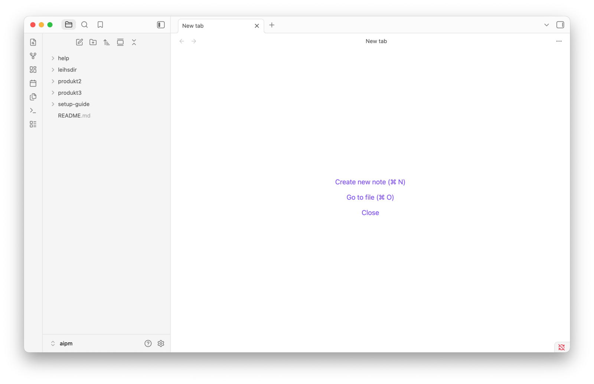

# AIPM Setup Guide -- Codex

Willkommen! Diese Anleitung hilft dir, deine Arbeitsumgebung für das Training einzurichten. Du brauchst **Codex** (den KI-Assistenten von OpenAI für die Kommandozeile) und **Obsidian** (einen komfortablen Editor für Textdateien im Markdown-Format).

Plane ca. 30 Minuten ein.

> **Nutzt ihr Claude Code statt Codex?** Dann nimm den [Setup Guide für Claude Code](../claude/README.md). Welches Werkzeug bei euch gilt, sagt dir dein Admin.

Am Ende hast du Obsidian mit drei Bereichen vor dir: links der Dateibrowser mit deinen Dateien, in der Mitte der Editor, rechts ein Terminal, in dem Codex läuft.

---

## Schritt 1: Ordner anlegen & Demo-Dateien holen

### Ordner anlegen

> **Neu bei der Kommandozeile?** Die Kommandozeile (auch Terminal genannt) ist ein Textfenster, in das du Befehle eintippst. Auf dem **Mac** findest du sie unter Programme → Dienstprogramme → Terminal (oder über Spotlight: `Cmd+Leertaste`, dann "Terminal" tippen). Unter **Windows** öffnest du PowerShell über das Startmenü (nach "PowerShell" suchen). Tippe den jeweiligen Befehl ein und drücke `Enter`, um ihn auszuführen.

Erstelle einen Ordner `aipm` in deinem Home-Verzeichnis:

**Mac (Terminal):**
```
mkdir ~/aipm
```

**Windows (PowerShell):**
```
mkdir $HOME\aipm
```

### Demo-Dateien herunterladen

Klone das Repository in deinen neuen Ordner:

**Mac (Terminal):**
```
git clone https://github.com/soehme/aipm-setupguide ~/aipm
```

**Windows (PowerShell):**
```
git clone https://github.com/soehme/aipm-setupguide $HOME\aipm
```

Danach findest du in `~/aipm` mehrere Beispieldateien und Ordner, die wir im Training nutzen.

> **"git" nicht erkannt?** Git ist dann nicht installiert. Entweder Git nachinstallieren ([git-scm.com/download/win](https://git-scm.com/download/win), PowerShell danach neu starten) oder das Repository als ZIP manuell von `https://github.com/soehme/aipm-setupguide` herunterladen (grüner "Code"-Button → "Download ZIP"). Details: [troubleshooting.md](../troubleshooting.md)

---

## Schritt 2: Codex installieren

> **Erst zum Admin.** Viele Unternehmen schränken ein, was auf dem Arbeitsrechner installiert werden darf, und geben einen eigenen Weg vor -- ein internes Software-Portal, eine vorbereitete Version oder einen Proxy. Frag vor der Installation nach, wie Codex bei euch installiert und angemeldet wird. Die Wege unten sind der Standardfall.

### Was ist Codex?

Codex ist OpenAIs KI-Assistent für die Kommandozeile. Du stellst Fragen oder gibst Aufgaben in natürlicher Sprache ein, und Codex arbeitet direkt mit deinen Dateien -- liest, schreibt, analysiert und erklärt.

### Installation

**Mac (empfohlen -- Homebrew):**
```
brew install --cask codex
```

**Mac (alternativ) und Windows:**
```
npm install -g @openai/codex
```
Voraussetzung: Node.js 18 oder neuer (`node --version` zum Prüfen).

> **"npm" oder "node" nicht erkannt?** Node.js ist nicht installiert. Download: [nodejs.org/de/download](https://nodejs.org/de/download) -- beim Installer darauf achten, dass **"Add to PATH"** angehakt ist. Danach PowerShell neu starten. Details: [troubleshooting.md](../troubleshooting.md)

Prüfe danach, ob die Installation geklappt hat:

```
codex --version
```

### Zugang einrichten

Codex braucht Zugang zu einem Sprachmodell. Es gibt drei Wege, und welcher bei euch gilt, hängt vom Unternehmen ab:

1. **ChatGPT-Account** -- `codex login` öffnet den Browser, du meldest dich mit dem Account deines Unternehmens an.
2. **API Key** -- `codex login --with-api-key`, danach fügst du den Schlüssel ein.
3. **Eigener Anbieter** -- Manche Unternehmen leiten Codex über einen eigenen Dienst (etwa Azure oder einen Proxy). Dann steht die Konfiguration in `~/.codex/config.toml` und wird meist von der IT vorgegeben.

> **Welcher Weg gilt für mich?** Frag deinen Admin oder die Kolleg:innen, die Codex schon nutzen. Richte den Zugang **vor dem Training** ein -- das ist der Schritt, der erfahrungsgemäß am längsten dauert.

Prüfen kannst du den Stand jederzeit mit:

```
codex login status
```

### Test: Funktioniert alles?

Wechsle in den `aipm`-Ordner und starte Codex:

**Mac (Terminal):**
```
cd ~/aipm
codex
```

**Windows (PowerShell):**
```
cd $HOME\aipm
codex
```

Tippe dann:
```
Was ist 2 + 2?
```

Wenn du eine Antwort bekommst, ist alles eingerichtet. Beende mit `/exit`.

> **Läuft etwas schief?** Codex bringt eine eigene Diagnose mit: `codex doctor` prüft Installation, Konfiguration, Anmeldung und Berechtigungen in einem Durchgang. Mehr dazu in [troubleshooting.md für Codex](troubleshooting.md).

---

## Schritt 3: Obsidian installieren

> **Auch hier gilt:** Wenn du Software nicht selbst installieren darfst, frag deinen Admin nach Obsidian. Manche Unternehmen verteilen es über ein eigenes Portal.

### Was ist Obsidian?

Obsidian ist ein Editor für Markdown-Textdateien mit integriertem Dateibrowser. Für uns ist es die komfortable Oberfläche, in der wir Dateien verwalten, bearbeiten und mit KI arbeiten -- ohne Entwicklertools.

### Installation

1. Lade Obsidian herunter: [obsidian.md/download](https://obsidian.md/download)
2. Installiere die App (Mac: in den Applications-Ordner ziehen)

**Alternativ mit Homebrew (Mac):**
```
brew install --cask obsidian
```

### Vault öffnen

1. Starte Obsidian
2. Wähle **"Open folder as vault"** (Ordner als Vault öffnen)
3. Navigiere zu `~/aipm` und wähle den Ordner aus
4. Klicke **"Open"**

### Einstellungen: schon erledigt

Ein paar Einstellungen bringt der `aipm`-Ordner bereits mit -- sie gelten automatisch, sobald du ihn als Vault öffnest:

- Anhänge landen in einem Unterordner `attachments` neben der jeweiligen Datei
- Der Dateibrowser zeigt alle Dateitypen an, nicht nur Markdown
- Die Endung `.md` ist im Dateibrowser sichtbar
- Der Dateiname steht nicht doppelt im Editor

> **Nichts davon zu sehen?** Dann hast du vermutlich einen anderen Ordner als Vault geöffnet oder die Dateien fehlen. Die Einstellungen lassen sich von Hand nachziehen: [Obsidian-Einstellungen manuell setzen](../troubleshooting.md#obsidian-einstellungen-manuell-setzen)

### Oberfläche einrichten

- **Linke Sidebar:** Klicke auf das Ordner-Symbol oben links, um den Dateibrowser zu sehen. Hier siehst du alle Dateien in deinem Vault.
- **Rechte Sidebar:** Schließe sie mit Klick auf den Pfeil, um mehr Platz zu haben.

So sollte Obsidian danach aussehen:



### Test: Erste Datei erstellen

1. Drücke `Cmd+N` (Mac) bzw. `Ctrl+N` (Windows) für eine neue Datei
2. Gib ihr einen Namen, z.B. "Meine erste Notiz"
3. Schreibe ein paar Zeilen Text
4. Finde die Datei im Finder/Explorer unter `~/aipm/`
5. Lösche die Testdatei wieder (Rechtsklick in Obsidian -> Delete)

---

## Schritt 4: Obsidian Plugins installieren

### Community Plugins aktivieren

1. Öffne Einstellungen (`Cmd+,`)
2. Gehe zu **Community Plugins**
3. Klicke **"Turn on community plugins"**

### Plugin 1: Terminal

Damit kannst du ein Terminal direkt in Obsidian öffnen -- dort läuft dann Codex.

1. In Community Plugins auf **"Browse"** klicken
2. Nach **"Terminal"** suchen
3. **"Install"** und dann **"Enable"** klicken
4. Verlasse diesen Dialog der Community Plugins
5. Öffne die Einstellungen von Terminal (unter Community Plugins -> Terminal -> Zahnrad-Symbol)
6. Setze "New instance behaviour" auf "New vertical split"
7. Setze "Default Profile" auf das passende integrierte Profil für dein Betriebssystem:
   - **Mac:** `darwinIntegratedDefault`
   - **Windows:** `win32IntegratedDefault`
   - **Linux:** `linuxIntegratedDefault`

### Plugin 2: Show Hidden Files

Dieses Plugin zeigt versteckte Dateien und Ordner (die mit `.` beginnen) im Dateibrowser an.

1. In Community Plugins auf **"Browse"** klicken
2. Nach **"Show Hidden Files"** suchen
3. **"Install"** und dann **"Enable"** klicken
4. Starte Obsidian neu (Menü: Quit, dann erneut öffnen), damit versteckte Ordner angezeigt werden

> **Hinweis:** Falls dein Vault sehr große versteckte Ordner enthält (z.B. `.git` mit vielen Dateien), kann Obsidian kurz langsamer werden.


---

## Schritt 5: Test -- alles eingerichtet

Prüfe, ob alle Komponenten funktionieren:

- **Obsidian:** Zeigt deinen `~/aipm` Vault mit allen Dateien an
- **Versteckte Dateien:** Der Ordner `.versteckterOrdner` ist unter `help/` sichtbar
- **Terminal Plugin:** Lässt sich in Obsidian öffnen (Command Palette: `Cmd+P` (Mac) bzw. `Ctrl+P` (Windows), dann "Terminal default")
- **Codex:** Starte `codex` im Terminal und stelle eine Testfrage ("Was ist 2 + 2?")
- **Diagnose:** `codex doctor` läuft durch und meldet keine roten Punkte

> **Berechtigungen kommen im Training.** Codex entscheidet über einen Sandbox-Modus, wie viel es darf -- lesen, im Arbeitsordner schreiben oder alles. Das stellen wir gemeinsam ein, du musst dich vorher nicht darum kümmern. Wer trotzdem schon reinschauen will: [Codex Basics](../../help/codex/codex-basics.md).

Gibt es noch Fehler? Schau in [troubleshooting.md](../troubleshooting.md) (git, Node.js, Terminal-Plugin) oder in [troubleshooting.md für Codex](troubleshooting.md) -- oder melde dich bei mir!

> **Tipp:** In deinem `~/aipm`-Ordner findest du Hilfsdateien unter `help/`, die dir beim Start mit Markdown, Obsidian und Codex helfen.

---

## Schritt 6: Aufräumen

Zum Abschluss räumen wir zwei Dinge weg.

**Die Git-Verbindung.** Damit wird `~/aipm` ein normaler Arbeitsordner und niemand überschreibt versehentlich mit `git pull` eigene Änderungen.

**Die Claude-Code-Dateien.** Dieses Repository enthält Anleitungen für zwei Werkzeuge: Codex und Claude Code. Du arbeitest mit Codex, also kommen die Claude-Dateien weg -- sonst stehen sie im Dateibrowser herum und stiften Verwirrung.

> **Bevor du das ausführst:** Die folgenden Befehle löschen Ordner endgültig, ohne Papierkorb. Prüfe, dass in den Pfaden wirklich `aipm` steht und du nichts Eigenes in `setup-guide/claude` oder `help/claude` abgelegt hast.

**Mac/Linux (Terminal):**
```
rm -rf ~/aipm/.git ~/aipm/.claude ~/aipm/setup-guide/claude ~/aipm/help/claude
```

**Windows (PowerShell):**
```
Remove-Item -Recurse -Force $HOME\aipm\.git, $HOME\aipm\.claude, $HOME\aipm\setup-guide\claude, $HOME\aipm\help\claude
```

### Test: Alles weg?

Wechsle in deinem Terminal in den `~/aipm`-Ordner und führe aus:

```
cd ~/aipm
git status
```

Du solltest eine Fehlermeldung wie `"fatal: not a git repository"` sehen. Das ist gewünscht -- `~/aipm` ist jetzt ein normaler Arbeitsordner.

Schau außerdem in Obsidian in den Dateibrowser: Unter `setup-guide/` und `help/` gibt es keinen `claude`-Ordner mehr.

---

## Geschafft!

Super, du bist eingerichtet. Freu dich aufs Training!

In deinem `~/aipm`-Ordner findest du:
- `help/` -- Hilfsdateien zu Markdown, Obsidian und Codex
- `leihsdir/`, `produkt2/`, `produkt3/` -- drei getrennte Produktkontexte für die Übungen

Schau gerne auch schonmal in Obsidian die Dateien im `help/` Ordner an, um etwas besser zu verstehen, was du gerade eingerichtet hast:
1. [Obsidian Basics](../../help/obsidian-basics.md)
2. [Markdown Basics](../../help/markdown-basics.md)
3. [Codex Basics](../../help/codex/codex-basics.md)

Bei Fragen melde dich gerne vor dem Training.
